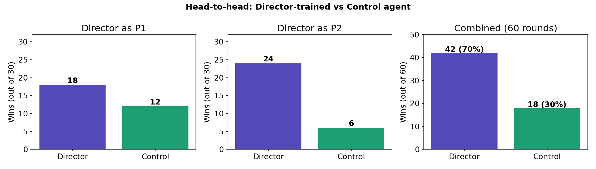
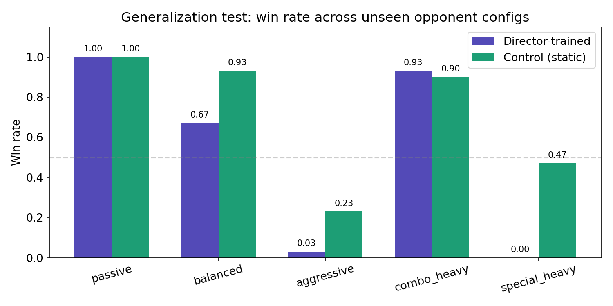
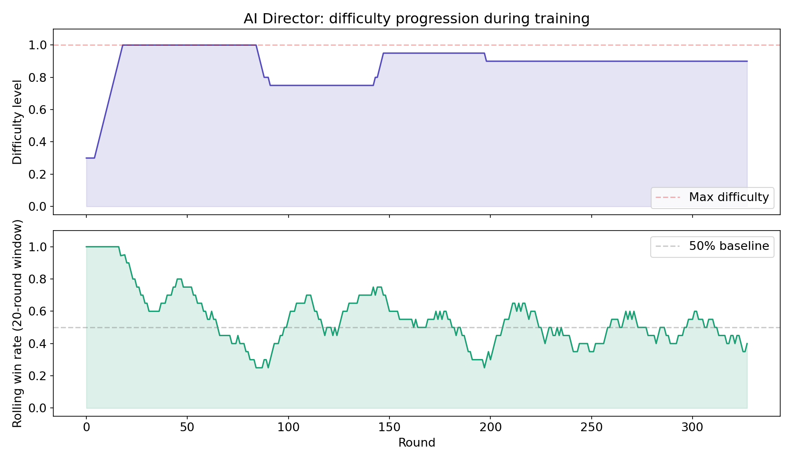

# Adaptive AI Director for Reinforcement Learning in Fighting Games

Does training a PPO agent against an *adaptive* opponent produce a better fighter than training it against a *static* one?

This repository contains a controlled experiment answering that question in [DareFightingICE](https://github.com/TeamFightingICE/FightingICE), a 2D fighting-game research platform. The result is split, and interestingly so.

**Stack:** Python · Gymnasium · Stable-Baselines3 (PPO) · pyftg · FightingICE (Java)

---

## The experiment

Two agents, identical architecture and training budget, differing only in what they trained against:

- **Control** — trains against a fixed-difficulty scripted opponent
- **Experimental** — trains against a scripted opponent whose difficulty is continuously retuned by an AI Director

Both run 1,000,000 timesteps of PPO. Both are then evaluated against five opponent configurations neither one saw during training, and against each other.

## The AI Director

The Director is a thermostat controller operating on a slower timescale than the agent — per-round rather than per-frame. After each round it looks at the student's win rate over a 20-round rolling window:

- above 70% → raise difficulty
- below 30% → lower difficulty
- in between → hold, keeping the student in the zone of proximal development

A scalar difficulty level in [0, 1] maps onto four concrete opponent parameters:

| Parameter | Range | Effect |
|---|---|---|
| `aggression` | 0.2 – 0.8 | probability of attacking vs. playing passive |
| `combo_frequency` | 0.1 – 0.6 | probability of chaining attacks |
| `special_frequency` | 0.05 – 0.4 | probability of using special moves |
| `reaction_delay` | 12 – 2 frames | thinking time before acting |

The opponent is deliberately simple. It exists to be a *tunable* challenge, not a strong fighter — otherwise the difficulty axis isn't clean.

## Environment

A Gymnasium wrapper over FightingICE, communicating with the Java game through pyftg. The game thread and the RL thread are synchronized by a pair of queues: the game pushes `FrameData` as it arrives, the RL loop pushes back action names.

- **Observation** — `Box(-1, 1, shape=(28,))`, normalized character and relational state
- **Action** — `Discrete(40)`, the commandable subset of FightingICE's 56-action enum, excluding states the game enters automatically (recovery, knockdown)
- **Reward** — per-frame HP delta, `(damage_dealt − damage_taken) / MAX_HP`, plus ±1 at round end for win or loss

---

## Results

### Head-to-head: Director-trained wins decisively



**42–18 across 60 rounds (70%).** Positions were swapped to control for P1/P2 asymmetry, and the effect survives it — though not evenly. As P2 the Director agent won 24–6; as P1, only 18–12. The gap between those two is larger than I'd expect from position alone, and I don't yet have an explanation for it.

### Generalization: the hypothesis fails



Against five unseen opponent configurations, 30 rounds each, the Director-trained agent **does not** generalize better. It ties on `passive`, edges out control on `combo_heavy`, and loses on the other three — badly on `special_heavy`, where it wins zero rounds against control's 47%.

So the original research question gets a negative answer. Adaptive curriculum training produced an agent specialized at beating the particular opponent it was shaped against, not a more robust one.

### Why: the curriculum saturated



The Director log explains part of it. Difficulty hit the 1.0 ceiling by round 18 and stayed pinned near maximum for the rest of training, with only a brief dip around round 85. Rolling win rate then hovered around 0.4–0.5 for 300 rounds.

That means the intended curriculum — a gradual ramp holding the student near 50% — collapsed almost immediately into "maximum difficulty, permanently." The experimental condition was, in practice, mostly *hard static opponent* rather than *adaptive opponent*. The difficulty range is too narrow, or `DIRECTOR_STEP` (0.05) too coarse, for the thermostat to do the work it was designed to do.

### What I'd change

- **Widen the difficulty range.** The ceiling was hit in 18 rounds; the parameter mapping needs to extend well past what it currently reaches.
- **Run multiple seeds.** Every number here is a single training run. With one seed there's no way to separate a real effect from variance, and that limits how much weight the head-to-head result can carry.
- **Test intermediate curricula.** Since the adaptive condition degenerated into a static hard one, the actual comparison being made isn't the one intended.

---

## Repository layout

```
src/
├── Environment.py            Gymnasium wrapper (FrameData → obs, action → Key)
├── GymAI.py                  pyftg AIInterface bridging game thread and RL loop
├── ParameterizedOpponent.py  scripted opponent with tunable difficulty
├── director.py               AI Director — thermostat curriculum controller
├── config.py                 constants, action set, PPO hyperparameters
├── train.py                  training entry point (experimental condition)
├── train_control.py          training entry point (control condition)
├── Evaluate.py               generalization test across unseen configs
├── visualize.py              figure generation
├── run_fight.py              run a trained model in a visible match
├── run_demo.py               demo runner
└── results/                  figures and evaluation data
```

## Setup

**1. Java 21** — required by FightingICE. Check with `java -version`; get OpenJDK 21 from [adoptium.net](https://adoptium.net) if needed.

**2. Python dependencies:**

```bash
pip install gymnasium stable-baselines3 pyftg numpy matplotlib
```

**3. Start the game** in pyftg mode from your FightingICE directory:

```bash
# Windows
run-windows-amd64.bat --pyftg-mode

# macOS
./run-macos-arm64.sh --pyftg-mode

# Linux
./run-linux-amd64.sh --pyftg-mode
```

Add `--fastmode` when training — it disables rendering and runs roughly 10× faster.

## Running

```bash
python src/train.py           # experimental condition (Director active)
python src/train_control.py   # control condition (static opponent)
python src/Evaluate.py        # generalization test, 5 configs × 30 rounds
python src/visualize.py       # regenerate figures
```

Key parameters live in `src/config.py` — PPO hyperparameters, Director thresholds and step size, reward normalization constants.

## Tuning the Director

| Constant | Default | Meaning |
|---|---|---|
| `DIRECTOR_HISTORY` | 20 | rolling window for win-rate calculation |
| `DIRECTOR_UP_THRESHOLD` | 0.7 | win rate triggering a difficulty increase |
| `DIRECTOR_DOWN_THRESHOLD` | 0.3 | win rate triggering a decrease |
| `DIRECTOR_STEP` | 0.05 | difficulty change per adjustment |

---

## Background

Built during the Math Path Summer REU at Georgia State University (FanDuel-sponsored), May–August 2026. Selected as 1 of 7 projects.

FightingICE is developed by the Intelligent Computer Entertainment Lab at Ritsumeikan University.
